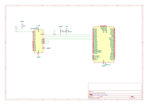

# ESP32-S3 USB MIDI Drum Kit

An experimental electronic drum controller that converts piezo sensor signals into USB MIDI events. The project runs on an ESP32-S3 and uses a CD74HC4067 analog multiplexer to support up to 16 drum pads.

This repository contains the first prototype and is intended for development and testing.

## Features

- 16-channel piezo sensor input through a CD74HC4067 multiplexer
- USB MIDI note output from the ESP32-S3
- Peak detection for reliable hit registration
- Velocity-sensitive MIDI notes based on hit intensity
- Per-channel retrigger masking to reduce false triggers
- Flam detection for closely spaced double hits
- RGB LED feedback based on hit velocity

## Hardware

- ESP32-S3 development board with native USB support
- CD74HC4067 analog multiplexer
- Piezo sensors
- Drum pad hardware and supporting resistors or signal-conditioning components as required

The current pin assignments and MIDI note mapping are defined near the top of `drumpad_phase1.ino`.

## Setup

1. Open `drumpad_phase1.ino` in the Arduino IDE.
2. Select an ESP32-S3 board with USB support.
3. Connect the multiplexer and piezo sensors according to the wiring schematic.
4. Upload the sketch to the board.
5. Connect the board to a computer or compatible MIDI host over USB.

Thresholds, timing values, pin assignments, and MIDI note mappings are currently defined directly in the sketch. Changing them requires editing the source before uploading it to the board.

## Wiring Schematic

## Project Status

This is an early prototype. Sensor conditioning, pad mechanics, sensitivity calibration, and MIDI mappings may change as development continues.